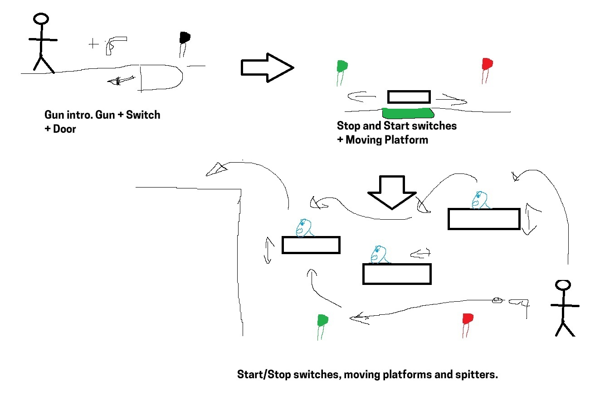

# COMP2150  - Level Design Document
### Name: [Kyle Rampal]
### Student number: [47145986] 

## 1. Player Experience

### 1.1. Discovery
The key to facilitating the player's experience of discovery can be found in the level’s learning progression. This platforming level I have created utilizes this progressive quality, where mechanics are slowly introduced and extrapolated throughout the gameplay. Often, new mechanics (such as the acid in section 1 or the gun in section 3) are introduced in a “safe” and simple environment, where the player can discover their usability without large amounts of tension and when the game’s challenge is at its lowest. New properties, emergent strategies, and unique interactions between mechanics are then progressively introduced throughout the level, furthering the discovery experience for the player. An example of this can be seen with breakable objects alongside the moveable objects with their damaging quality, being able to be pushed but also dropped on enemies to beat them. An introduction of a mechanic is typically followed up by the continuation of an old one in conjunction with this new mechanic. This is repeated cyclically, keeping the player in a state of flow. Important “aha” moments can be found with the “start and stop” functions of switches alongside moving platforms and their interaction with bullets, or pushing moveable objects into acid to use as a platform. Through this, the player learns the integral skills needed for the level’s completion; physical and intellectual ones. This use of mechanic progression and interweaving creates an environment for the player that is an interesting one, creating complex systems and facilitating good game design.

### 1.2. Drama
The drama of the game is achieved through a state of being called “flow”, described as a “holistic sensation when we act with total involvement” (Csikszentmihalyi, M. 2014). Within games, this is gained through a design principle known as a “difficulty curve”, a finely tuned pathway where the players experience dances between anxiety and boredom through modulated increases in difficulty (Edmond, C, 2024 “Challenge & Drama”). Within each section of the level, there are varying degrees of challenge, and therefore drama, that the player will experience cyclically. Section one showcases these degrees expertly, with the introduction of mechanics within safe environments such as acid, spikes, moving platforms, and moveable blocks, the joint usage of these mechanics for the middling levels of drama, followed by the peak of the sections challenge, where a moving platform serves as a pseudo-time limit, directing the player into spikes and acid, forcing the player to rely on the skills they have gained to conquer the toughest part of the level. This slow ramping of danger followed by the introduction of a new section puts the player in a flow state, achieving the game's intended drama.

### 1.3. Challenge
The level specifically challenges the player through physical and intellectual challenges. This can be seen throughout the level through jumping puzzles, timed shots to open doors or stop moving platforms, quick reflexes to avoid falling obstacles, or even through puzzle-based challenges, such as closing doors to push objects into designated areas. Through the use of mechanic iteration, the player is kept within the flow state, gaining the skills necessary to complete the sections and the level as a whole. The sections were designed with separate skills necessary for completion. The first section lacks enemies but offers low-level intellectual challenges and a medium degree of physical challenge. This is supposed to be the initial building block for the level, where section two focuses on physical difficulty, where the player is given a staff and is placed against enemies, and section three focuses primarily on intellectual difficulty, where the player is given the gun, a tool that can shoot enemies but also activate switches far away to move, stop and reset platforms. The differentiation between the three sections allows for the slow progression of the player's skills, not overwhelming the player while keeping them within a state of flow.

### 1.4. Exploration
The level’s experience of exploration can be found within all three sections. Initially, the player spawns in and can see to their left, a locked door. This offers a level of intrigue within the player, and serves in the future as a link back to the beginning, in case the player discovers alternate routes between the sections found in sections two and three. Moving platforms uncovering new territory also gives off the experience of exploration, and most importantly, the level's design allows for non-linearity within its gameplay, providing the biggest blessing to the level's sense of exploration. In section one, this can be seen with the initial moving platform and moveable block. The player can move the block onto the platform, allowing them to jump to the final area of section one. They can backtrack the intended movements, finding the key, and skipping a majority of the first section. Section two offers the ability to also use a moving platform alongside a pressure pad and a moveable object, opening a door that leads to the beginning of section three. If this occurs, section three leads to the beginning of section one, allowing the player to complete section two and find the key for that level. This level of non-linear progression creates a sense of exploration within the player.

## 2. Core Gameplay
### 2.1 Acid
Acid is introduced initially, and forces the player to consider their jump ability. Acid is used to force a respawn, as opposed to spikes that are later introduced. Acid’s intended response from the player should make them feel like their actions matter, as they suffer a respawn from its effects. It can be seen bordering off certain parts of the sections, such as the platform drop sequence in section three, or the moving platform ending in section one.

### 2.2 Moving Platforms
Moving platforms are introduced as a traveling system, however are extrapolated quickly as a mechanic of physical difficulty. Initially, they direct you to the next challenge, however are quickly turned into the level’s version of a pseudo time limit, forcing the player to act with speed, pushing their physical skills.

### 2.3 Checkpoints
Checkpoints serve as a bastion of relief for the player. They are sprinkled throughout the area, often after difficult encounters or lengthy ones. The first checkpoint is introduced after the second acid jump with the moveable object. This could serve as a minor point of difficulty for newer players, but it would take a while to replay, justifying its inclusion.

### 2.4 Moveable objects
Moveable objects are introduced as a puzzle element, allowing the player to place them in strategic positions, elevating or elongating their jumps. They are later used offensively, launched at the player, damaging them. This also works against enemies, which is used in section two.

### 2.5 Door/Switch
Doors are initialized as blockades for the player. They stop the player's movement or, in its initial environment, the movement of a moveable object. The switch typically opens doors, but this can also be seen with the use of a pressure pad in section two. Switches can also alter the movements of platforms, as seen in section three.

### 2.6 Spikes
Spikes offer a spatial challenge for the player. They often limit jumps and movement. In the first iteration of spikes, they stop the player from jumping to the next section, making them push an object to reach those heights.

### 2.7 Health Pickups
Health pickups are given after intense moments, such as its introduction at the end of section one. They give the player release, lowering their anxiety levels, and keeping them in a state of flow. They also serve as a reward in section two, where the player can opt to complete an optional area for health rewards.

### 2.8 Keys
Keys are necessary to complete the level and give the player a sense of accomplishment. It is given at the end of each section.

### 2.9 Chompers
Chompers are initially given to the player when they have no weapon and are used throughout the game as a zoning enemy, creating a challenge by giving the player space to work with. An example of that can be seen at the end of section two.

### 2.10 Spitters
Spitters are the majority of the enemies found within this level. They give the player a physical challenge, where they often have to dodge out of the way of their projectiles, nimbly getting to their position. They are often used with moving platforms, seen throughout sections two and three, where the player's movements are limited.

### 2.11 Staff Pickup
The staff is used to break breakable objects and destroy chompers and spitters. This is often used in conjunction with moveable objects.

### 2.12 Breakable Objects
These are used to blockade the player or to position enemies higher up. Also used to put moveable objects out of reach.

### 2.13 Pressure Pad
These are used initially to serve as a puzzle for opening doors. They serve this purpose throughout the game

### 2.14 Gun
The gun is introduced in section three, primarily as a tool and secondarily as a weapon. It is used alongside the switch, turning them on from far away. This can move platforms from afar.

## 3. Spatiotemporal Design

### 3.1. Molecule Diagram

### 3.2. Level Map – Section 1

### 3.3.	Level Map – Section 2

### 3.4.	Level Map – Section 3

## 4. Iterative Design

Iterative design was integral to the success of my level. Using playtesting, storyboarding, and molecule diagrams allowed me to design an environment where the player could learn the game’s mechanics progressively without overloading. Initially, my first section contained the introduction of enemies. I used enemies as an unbeatable obstacle, one where you would have to outrun it. The intention was to provide a sense of achievement upon grabbing the staff and being able to beat this once unbeatable obstacle. This did not pan out, I found the challenge minimal and boring. I also found that my intended outcomes for the level did not include large amounts of enemies, in particular chompers. While their inclusion is purposeful, their use in section two being one of particular importance, the game overall does not promote large combat elements. I pushed away from chompers and moved towards spitters, which could double as a “sentry” and area-denial mechanic. The spitters served this purpose well, however even those enemies I found to be troublesome, their projectiles would enter areas that should not include them. Throughout the level, the specific spitter's field of view has been altered. I think this is a band-aid solution, one that could be fixed through more iterations. Section three could also have used more iterations. The puzzle nature of the level has not been fulfilled, I think through more iterations I could have extrapolated more on the stop-and-start mechanics. 

## 5. Bibliography
Csikszentmihalyi, M. (2014). Play and Intrinsic Rewards. In: Flow and the Foundations of Positive Psychology. Springer, Dordrecht. https://doi-org.simsrad.net.ocs.mq.edu.au/10.1007/978-94-017-9088-8_10

Edmond, C. (2024) Challenge & Drama. COMP2150 Game Design

